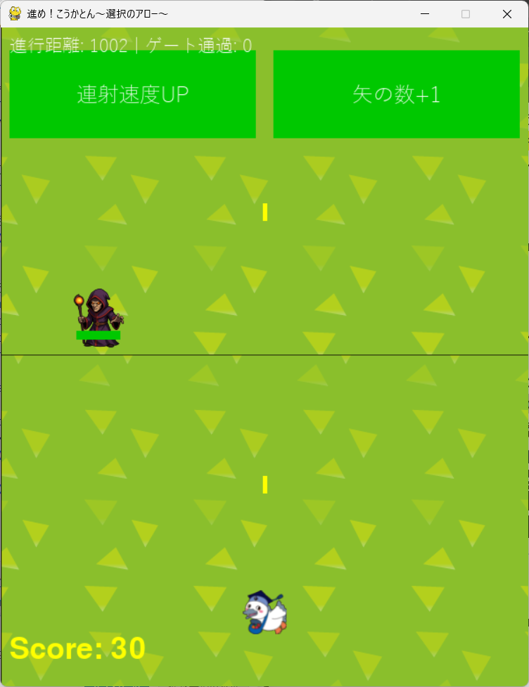

# 進め！こうかとん～選択のアロー～

## 実行環境の必要条件
* python >= 3.10
* pygame >= 2.1

## ゲームの概要
* 自動で縦スクロールするステージで、こうかとんを操作するシューティングゲームです。
*こうかとんは自動で発射される矢で敵を倒し、ハイスコアを目指します。
* 参考URL：[Arrow a Row](https://store.steampowered.com/app/2495980/_Arrow_a_Row/)

## ゲームの遊び方
* 矢印キーでこうかとんを動かし、敵を倒す。
* こうかとんが敵に触れたらGAMEOVERとなる。

## ゲームの実装
### 共通基本機能
* pygameで自分と敵キャラ、追加効果の描画

### 分担追加機能
**自動スクロール背景**: 戦闘中、背景が自動でスクロールし続けます。 (担当: 佐藤)
**敵キャラクター**:
    * 専用の画像を持つ敵が出現します。 (担当: 佐藤)
    * 敵は体力（HP）を持ち、体力バーで可視化されます。 (担当: 浅井)
    * ゲームの進行度（時間）に応じて、敵の最大HPが増加していきます。 (担当: 浅井)
**選択ゲート（パワーアップ）**:
    * 「連射速度UP」「矢の数+1」などのバフ効果が得られます。 (担当: 金澤)
    * 「連射速度DOWN」などのデバフ効果も存在します。 (担当: 金澤)
**ボス戦**:
    * ゲート通過2回ごとにボスが出現します。 (担当: 岡倉)
    * ボスは左右に移動しながら、プレイヤーを狙って爆弾を投下する攻撃を行います。 (担当: 岡倉)
**スコアシステム**:
    * 敵を倒すとスコアが加算されます（ザコ: 10点, ボス: 100点）。 (担当: 竹前)
    * ボス撃破時には「ボス撃破！」というメッセージが画面中央に表示されます。 (担当: 竹前)

### ToDo
- [ ] BGMや効果音の追加
- [ ] プレイヤーＨＰシステムの導入

### メモ
* こうかとんの画像変更、敵キャラの変更をした。背景設定し流れているが、背景の選択がいまいちであった
* ボス機能でボスの移動速度変更と爆弾を生成して当たるとGameOverになる仕組み(岡倉)
* 敵の中心に「現在のHP/最大HP」とそれに対する体力バーを表示させる。また、一定時間で最大HPを増加させる。
* スコア機能を実装し、左下に表示した。ザコ敵は１０ポイント増加、ボス敵は１００ポイント増加するようにした。ボス撃破時に「ボス撃破！」と画面中央に表示されるようにした。(竹前)
* 
